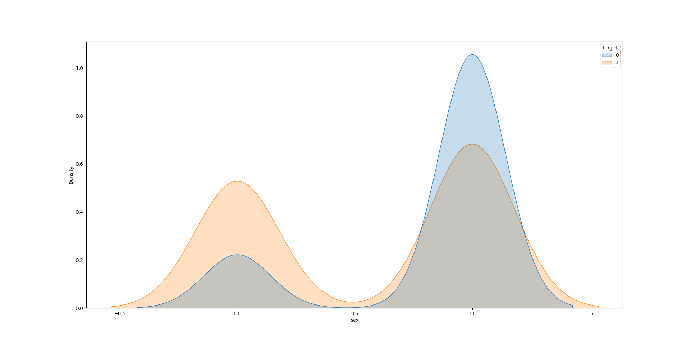

# UCDPA_AgnieszkaJarczok
# **Heart Issues Analysis Project**

## **Github:**
https://github.com/jagna27/UCDPA_AgnieszkaJarczok.git
___
## **Project Summary:**
This project aims to analize two different datasets containing 
data showing some health related records that involve the health 
of a variety of different individuals (those individuals are of mixed age   and gender). The analysis is performed using the popular scripting  language 'Python' and many of its data-science libraries.

### **Files:**
 - #### **Data** (data directory):
    - Heart Attack Data Set.csv
    - heart_failure_clinical_records_dataset.csv
 - #### **Python files** (src directory):
    - heart_disease_analysis.py

The above described program allows also to perform a more dynamic 
data analysis, offering to the user the opportunity to choose the data   they want to study and observe. The project can analyze various csv files with  a similar format, thus giving further freedom to the end user and making the whole   project more elastic to changes.
___
## **Introduction:**
The reason that brought me to choose this specific topic as   my project theme, is that I have always been profoundly fascinated by  the insights that a data analyst could derive from health related data.  The idea that computer science and more in the specific, data analysis  could help to improve the health of people suffering from various   diseases is the thing that motivated me the most during the whole process.
___
## **Datasets:**

- **Heart Attack Data Set.csv:**
 
In this dataset, there are 14 different clinical features: 
1. Age: Age (in years) 
2. Sex: gender (1 = male; 0 = female) 
3. ChestPain: Chest Pain type 
- 1: typical angina (all criteria present) 
- 2: atypical angina (two of three criteria satisfied) 
- 3: non-anginal pain (less than one criteria satisfied) 
- 4: asymptomatic (none of the criteria are satisfied) 
4. Restbps: Resting Blood pressure (in mmHg, upon admission to the hospital) 
5. Chol: serum cholesterol in mg/dL 
6. Fbs: fasting blood sugar > 120 mg/dL (likely to be diabetic) 1 = true; 0 = false 
7. RestECG: Resting electrocardiogram results 
- Value 0: normal 
- Value 1: having ST-T wave abnormality (T wave inversions and/or ST elevation or depression of > 0.05 mV) 
- Value 2: showing probable or definite left ventricular hypertrophy by Estes' criteria 
8. MaxHR: Greatest number of beats per minute your heart can possibly reach during all-out strenuous exercise. 
9. Exang: exercise induced angina (1 = yes; 0 = no)
10. Oldpeak: ST depression induced by exercise relative to rest (in mm, achieved by subtracting the lowest ST segment points during exercise and rest) 
11. Slope: the slope of the peak exercise ST segment, ST-T abnormalities are considered to be a crucial indicator for identifying presence of ischaemia 
- Value 1: upsloping 
- Value 2: flat 
- Value 3: downsloping 
12. Ca: number of major vessels (0-3) colored by fluoroscopy. Major cardial vessels are as goes: aorta, superior vena cava, inferior vena cava, pulmonary artery (oxygen-poor blood --> lungs), pulmonary veins (oxygen-rich blood --> heart), and coronary arteries (supplies blood to heart tissue). 
13. Thal: 
- 0 = normal; 
- 1 = fixed defect (heart tissue can't absorb thallium both under stress and in rest);
- 2 = reversible defect (heart tissue is unable to absorb thallium only under the exercise portion of the test) 
14. Target: 
- 0 = no disease;
- 1 = disease

**SOURCE:** 
https://www.kaggle.com/datasets/pritsheta/heart-attack

**MOTIVATION:** 
This dataset seemed to be the one that could be the best paired with the heart_failure_clinical_records_dataset (the next dataset to be described in this report).
This dataset has also scored a 10.0/10.0 in **Usability** on Kaggle, which was proved to be true in my case.

- **heart_failure_clinical_records_dataset.csv:**
 
In this dataset, there are 13 different attributes:
1. age: age of the patient (years)
2. anaemia: decrease of red blood cells or hemoglobin (boolean)
3. high blood pressure: if the patient has hypertension (boolean)
4. creatinine phosphokinase (CPK): level of the CPK enzyme in the blood (mcg/L)
5. diabetes: if the patient has diabetes (boolean)
6. ejection fraction: percentage of blood leaving the heart at each contraction (percentage)
7. platelets: platelets in the blood (kiloplatelets/mL)
8. sex: woman or man (binary)
9. serum creatinine: level of serum creatinine in the blood (mg/dL)
10. serum sodium: level of serum sodium in the blood (mEq/L)
11. smoking: if the patient smokes or not (boolean)
12. time: follow-up period (days)
13. [target] death event: if the patient deceased during the follow-up period (boolean)

**SOURCE:** 
https://archive.ics.uci.edu/ml/datasets/Heart+failure+clinical+records

**MOTIVATION:** 
The name of Davide Chicco isn't new to my ears, and he's very renowned in the machine learning community. I knew about his experience and that was crucial in my choice.
Additionally, the dataset is very new compared to many other I saw on the archive.ics.uci.edu archive, which could in future allow for a comparison between older and newer data in order to determine if there were external factors that impacted the results (for example in the case of tumors and related data, the Chernobyl disaster could have altered partially some health parameters in many Eastern European people).
___
## **Implementation process:**
About the implementation process, I knew the importance of error handling and that aspect is present in the entirety of my program. The first step consisted in the reading of the dataset, for that I wrote a function (**read_dataset**) that takes one string argument (**filename**) and reads the data contained in this file.
It was necessary considered my choice of using data from two different files instead of one.
The error handling is present here, in the form of a try-except instruction that can catch the non existance of the file provided as parameter.
If everything works fine, the result returned by this function, will be a pandas DataFrame.

The next step in my analysis, was the cleanse of the data, and for that I needed to check for duplicate rows, and/or missing data. For that I wrote the 'remove_duplicates' function, which wasn't used in the end because in those specific datasets there were no duplicate rows, and the 'check_missing_values' function that was used to analyze the dataset for any missing values.

After that, I assumed the end user may want to print out all the info about that specific dataset he wants to perform an analysis on, so the 'dataset_info' was of crucial importance at this stage.
It shows all the most important information about the dataset, including the correlation matrix, the minimum, mean, and maximum values for each column, the dimension of the dataset (more specifically of the DataFrame passed as argument to the function), and a sample of the first 5 rows of the dataset.

The next step included the separation of the dataset into three sets:
 - Training
 - Testing
 - Validating
That's common practice when the data needs to be prepared for further analysis using more complicated means like Machine Learning algorithms.
Also here, I wanted to give more freedom to the end user, by giving him the possibility to choose the amounts (percentages) of the dataset to destinate to each of those three sets.
In this case the error handling consists in the prevision of the user inputting (for error or not) an incorrect value, like for example a percentage value exceeding the upper range value, or a negative percentage value.

In the next step I took into consideration the importance of showing the results of our analysis through the use of plots. The function that performs those tasks is 'display_plots'. Here I used the matplotlib library as well as seaborn, to visualize a heatmap of the correlation matrix, and gave even more freedom to the user, by giving him the chance to choose the columns to be compared using the KDE plot (Kernel Density Estimation) to compare two columns of data at a time and derive from that valuable insights (some of them are described in below in the report).

The last part of this project, consisted in putting together all the tools I developed, and allow the user to interact with the program in a user-friendly way. For that I created a menu in the 'main' function, and for repetitive tasks like the input and the error handling of such data, I wrote an additional function 'choose_option'.
___
## **Results:**

The end result of hours of work and dedication, is a program that allows in an interactive way, to perform data analysis over various csv data files (in this case heart related data). After running the code, the whole program will guide the user to choose the analysis he considers crucial.
In the correlation matrix heatmap, we can point out more easily which parameters are correlated between themselves.
We say there is a negative correlation, the closer we get to -1, and that there is a stronger positive correlation, the more we approach the value of 1.

Other than that, there are no strong correlations visible in this plot (for this specific dataset - heart_failure_clinical_records_data.csv).
 
 
 
 

The Kernel Density Estimation, gives us a better insight into the data we're analyzing, in this specific case, we can easily see how the gender of a person has a huge impact on whether that person will get a heart attack or not. It is possible to comapare two different parameters and determine valuable results.

___
## **Insights:**

 - Women are more likely to suffer a heart attack.

 - There is a medium negative correlation between the number of days spent in the hospital, and the Death Event, it means that the more the patient remained in the hospital, the higher was the chance of survival (we may assume the patients that were removed first, are those that didn't survive).

 - People aged between 50 and 60, are more at risk of experiencing a heart attack.

 - People suffering of diabetes, have a higher chance of dying of a heart failure, than people not suffering from it.

 - Non smokers have a higher chance of surviving a heart attack.

